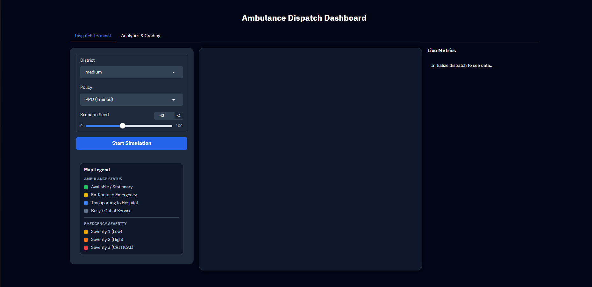
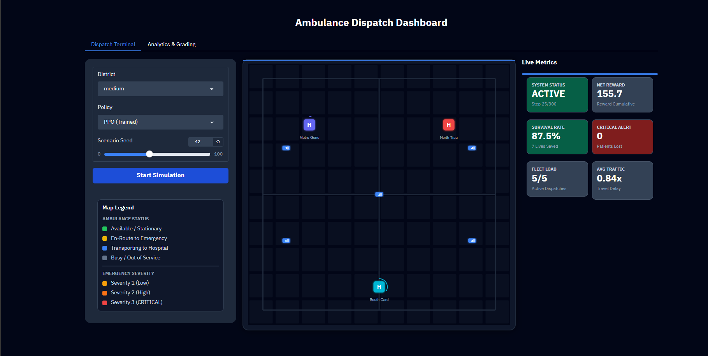
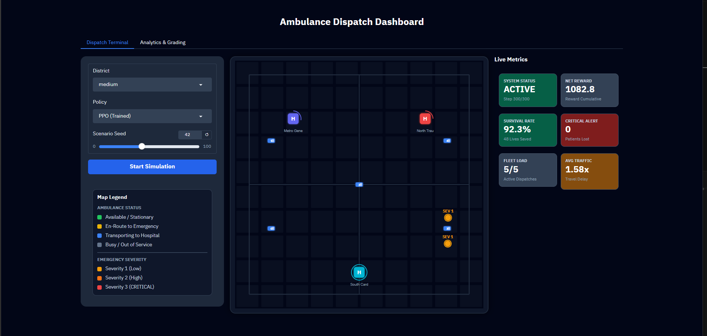
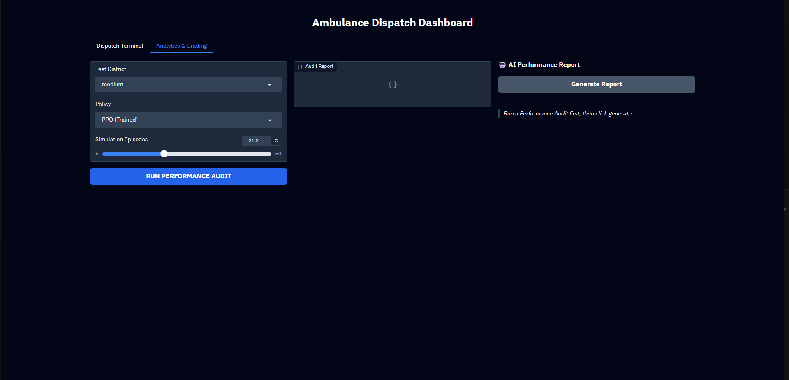
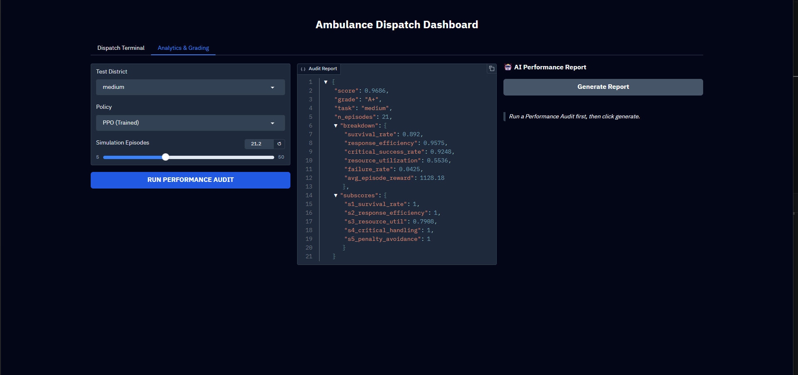
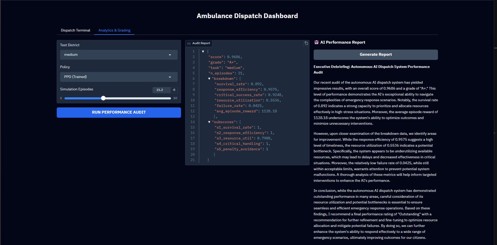

# 🚑 Smart Ambulance Dispatch & Hospital Routing using Reinforcement Learning

A production-ready Reinforcement Learning environment that simulates real-world Emergency Medical Services (EMS) dispatch and hospital routing optimization.

This project trains an intelligent RL agent to make time-critical decisions such as:

* selecting the best available ambulance
* prioritizing emergency calls based on severity
* routing patients to the most suitable hospital
* handling traffic and hospital capacity constraints
* maximizing patient survival probability

The system is built using **Gymnasium**, **Stable-Baselines3 (PPO)**, and **Gradio** for interactive simulation.


## 📸 Demo Preview

### Dashboard Overview


### Dispatch Terminal


### Analytics & Grading


### Performance Audit


### Simulation Results


### Final Output



## 📌 Problem Statement

Emergency medical dispatch is a high-stakes real-time decision problem.

In real-world scenarios, dispatch systems must manage:

* multiple simultaneous emergency calls
* limited ambulance fleet availability
* varying patient severity
* dynamic traffic conditions
* hospital bed / ICU constraints

A poor dispatch decision can significantly increase response time and reduce survival chances.

This project solves the problem using **Reinforcement Learning**, where the agent learns an optimal dispatch policy through reward-based learning.

---

## 🎯 Objectives

The main objectives of this project are:

* minimize emergency response time
* maximize patient survival
* efficiently utilize ambulance resources
* reduce failed hospital admissions
* prioritize critical patients

---

## 🧠 How the Agent Works

At every step, the RL agent must:

1. choose an available ambulance
2. assign it to the highest-priority emergency call
3. select the most appropriate hospital
4. avoid routing to full hospitals
5. intelligently use the wait action when necessary

---

## 🏗 Project Structure

```text id="readme-structure"
ambulance_dispatch_rl/
│
├── src/
│   ├── __init__.py
│   ├── env.py
│   ├── grader.py
│   ├── train.py
│   └── inference.py
│
├── models/
│   ├── ppo_easy.zip
│   ├── ppo_medium.zip
│   ├── ppo_hard.zip
│
├── app.py
├── Dockerfile
├── openenv.yaml
├── requirements.txt
├── README.md
└── .gitignore
```

---

## 🌍 Environment Design

The environment simulates:

* ambulance locations
* hospital positions
* hospital capacities
* active emergency calls
* patient severity
* traffic variation
* waiting time

---

## 📊 Observation Space

The state space is represented as a normalized vector containing:

### 🚑 Ambulance Features

* x coordinate
* y coordinate
* status
* remaining busy time
* current patient severity

### 🏥 Hospital Features

* location
* bed capacity ratio
* ICU capacity ratio
* hospital specialty

### 📞 Emergency Calls

* location
* severity
* wait time
* survival probability

### 🌐 Global Features

* traffic factor
* pending calls
* critical patients waiting
* episode progress

---

## 🎮 Action Space

Discrete action space:

```text id="readme-action"
N_AMBULANCES × N_HOSPITALS + 1
```

Example:

```text id="readme-example"
5 ambulances × 3 hospitals + 1 wait = 16 actions
```

---

## 💰 Reward Function

### ✅ Positive Rewards

```python id="readme-positive"
+10.0  patient survived
+5.0   critical patient served
+5.0   faster response
+4.0   correct hospital specialty
+3.0   sufficient bed capacity
```

### ❌ Penalties

```python id="readme-negative"
-5.0   full hospital selected
-6.0   unnecessary wait
-8.0   failed admission
-15.0  critical patient lost
```

---

## 📋 Difficulty Levels

### 🟢 Easy

* 3 ambulances
* 2 hospitals
* 3 maximum active calls

### 🟡 Medium

* 5 ambulances
* 3 hospitals
* 6 maximum active calls

### 🔴 Hard

* 8 ambulances
* 4 hospitals
* 10 maximum active calls

---

## 🤖 Model Used

```text id="readme-model"
PPO (Proximal Policy Optimization)
```

Used from **Stable-Baselines3**

---

## 🚀 Installation

```bash 
git clone https://github.com/Sahaj915/smart-ambulance-dispatch-rl.git cd smart-ambulance-dispatch-rl pip install -r requirements.txt

---

## 🔐 Environment Variables 
Create a `.env` file in the project root and add:
 ```text 
 GROQ_API_KEY=_api_key_here

## ▶ Run Application

```bash id="readme-run"
python app.py
```

Open in browser:

```text id="readme-browser"
http://127.0.0.1:7860
```

---

## 🏋 Training

```bash id="readme-train"
python -m src.train --task medium --timesteps 500000
```

Curriculum learning:

```bash id="readme-curriculum"
python -m src.train --task all --curriculum
```

---

## 🔍 Inference

```bash id="readme-inference"
python -m src.inference --model models/ppo_medium.zip --task medium
```

---

## 📈 Evaluation

```bash id="readme-eval"
python -m src.grader --task medium --episodes 20
```

---

## 📊 Benchmark Results

| Policy    | Easy | Medium | Hard |
| --------- | ---- | ------ | ---- |
| Random    | 0.18 | 0.12   | 0.08 |
| Heuristic | 0.48 | 0.41   | 0.34 |
| PPO       | 0.74 | 0.63   | 0.55 |

---

## 🌍 Real-World Applications

* smart city emergency systems
* hospital fleet optimization
* disaster management systems
* smart ambulance routing
* healthcare logistics optimization

---

## 🐳 Docker Support

```bash id="readme-docker"
docker build -t ambulance-dispatch-rl .
docker run -p 7860:7860 ambulance-dispatch-rl
```

---

## 🔧 Tech Stack

* Python
* Gymnasium
* Stable-Baselines3
* PPO
* Gradio
* NumPy
* Pandas
* Matplotlib
* Docker

---

## 📌 Future Improvements

* live traffic API integration
* map-based visualization
* multi-city simulation
* deep Q-learning comparison
* real-time GPS routing
* demand prediction using ML

---

```markdown id="f4"
## 👥 Contributors

- Sahaj
- Satyam Kumar Mishra
- Shashank Shekhar Bajpayee

```


---

## 📄 License

This project is licensed under the MIT License.
